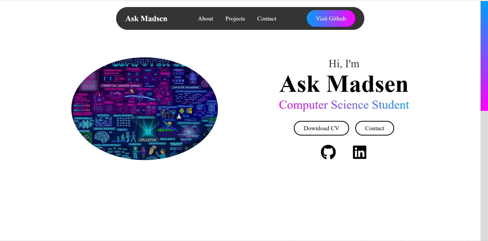

# Project Portfolio

A curated collection of my academic and personal projects in computer science, showcased through a GitHub Pages site.

## About

This repository contains a range of projects demonstrating my skills and learning journey in computer science.  
Projects include academic coursework (Python exercises, data structures, algorithms) as well as personal explorations in web development, machine learning, and other domains.  
The portfolio is hosted as a [GitHub Pages site](https://askmadsen.github.io/project-portfolio/) for easy browsing and demonstration.


## Project Structure

```
project-portfolio/
├─ index.html               # Homepage with About, Contact, and links to Academic & Personal Projects      
├─ README                   # Overview of the portfolio, link to github page, and contact info
├─ assets/                  # Folder for site-wide static assets
│    ├─ css/                # CSS styles for layout, colors, typography
│    │   └─ style.css       # Main stylesheet
│    └─ js/                 # JavaScript for interactive elements 
│        └─ script.js       # Main JS file
└─ projects/                # Folder containing all project-related pages and resources
    ├─ academic.html        # Page listing all academic projects with cards
    ├─ personal.html        # Page listing all personal projects with cards
    ├─ images/              # Screenshots, diagrams, and images for projects
    │   ├─ ...      
    │   └─ ...
    ├─ demos/               # Interactive demos or live project files
    │   ├─ ...      
    │   └─ ...
    └─ reports/             # PDF or document reports for projects    
        ├─ ...
        └─ ...
```


## How to Navigate

- Visit the [live portfolio](https://askmadsen.github.io/project-portfolio/) to explore projects.  
- **Academic Projects:** Organized by semester. Each project card links to the repository and report/exercise PDF if available.  
- **Personal Projects:** Categorized by type (Web, AI, Mobile, etc.), each card links to the repository, demo, and report if available.

## Portfolio Preview

[](https://askmadsen.github.io/project-portfolio/)


## Contact

Email: [askmadsen@gmail.com](mailto:askmadsen@gmail.com)  
GitHub: [https://github.com/askmadsen](https://github.com/askmadsen)  
LinkedIn: [https://www.linkedin.com/in/ask-madsen-a49819142/](https://www.linkedin.com/in/ask-madsen-a49819142/)
